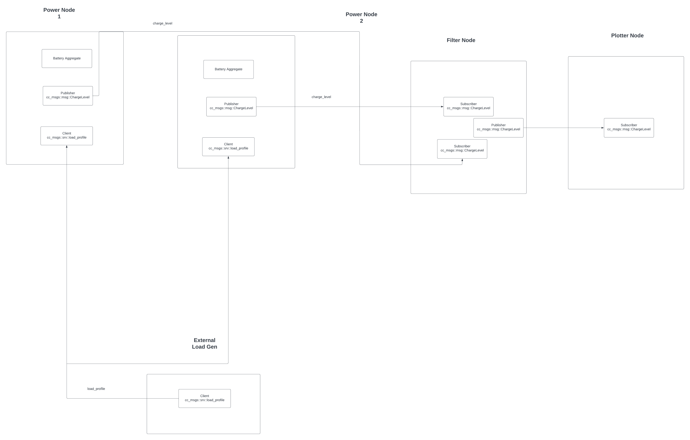
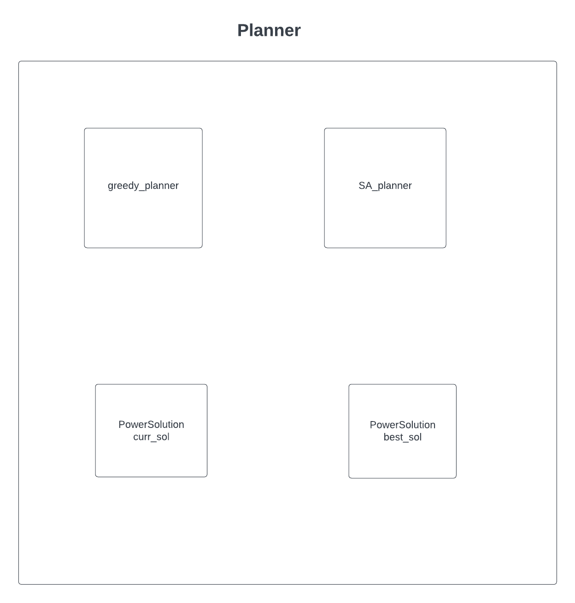
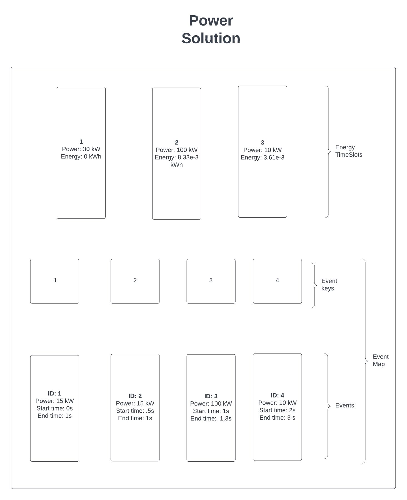
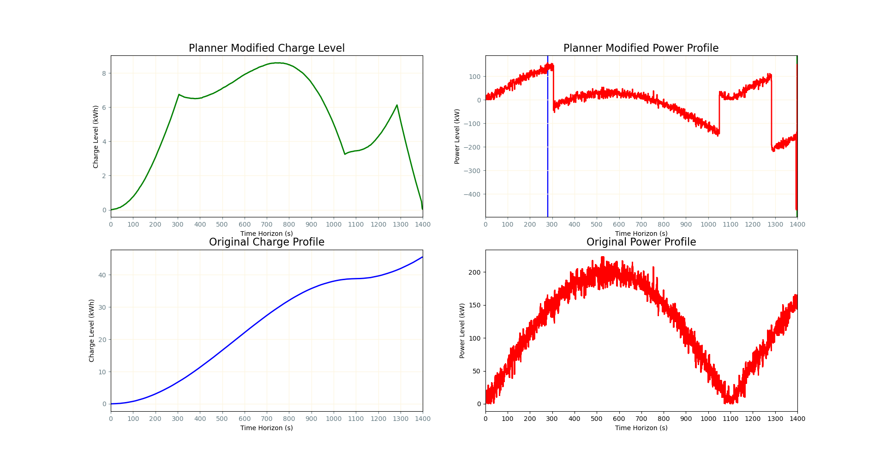
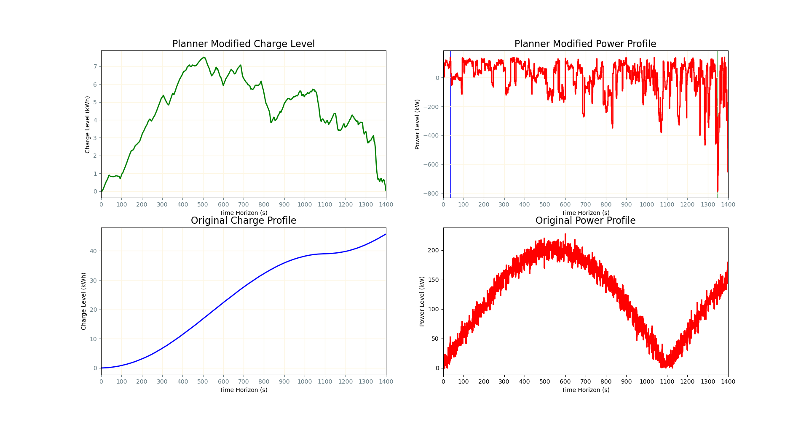
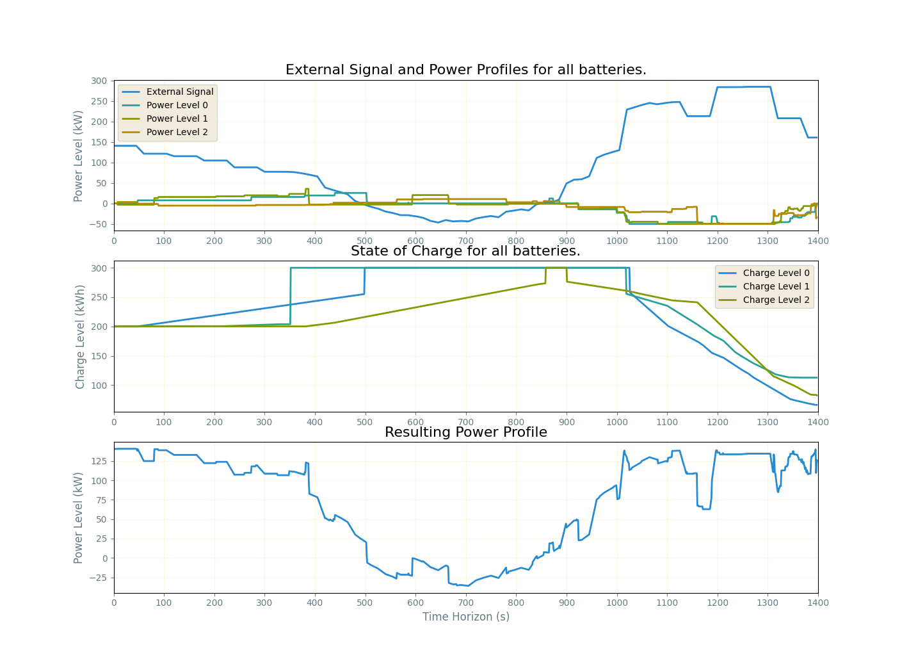
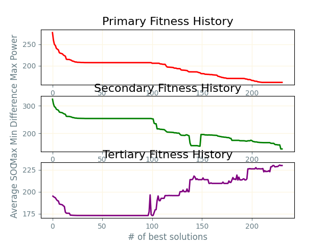

# Connected Communities Simulated Annealing

## Geting Started

### Downloading and setting up workspace

This code base was buily on ros2 humble haskell. This ROS Distro must be installed to run the code. This instructions assume you are using a debian based distribution.

Each of the required repos can be downloaded using wstool tool.
To use wstool, do the following:

* Create a workspace folder that will house the project `mkdir -p ~/connected_communities_SA/src`
* Navigate to the src folder
* create a new rosinstall file called cc.rosinstall `touch cc.rosinstall` with the following contents:

```
- git: {local-name: connected_communities_SA,
       uri: 'git@gitlab.com:utahstate/droge-robotics/sandbox/tim-dodge/connected_communities_sa.git',
       version: main}
```

* The run the following commands

```
wstool init .
wstool merge cc.rosinstall
wstool up
```

### Creating Python Virtual Environment

To create a virtual environment you must be in the root of the workspace.
The command below will create an alias for creating the needed virtual enviroment into your bashrc

```
alias make_cc_venv='python3 -m venv --system-site-packages venv && touch venv/COLCON_IGNORE'
```

The following command is an alias that will allow you to build the code it. IT MUST BE RUN FROM THE ROOT OF THE WORKSPACE.

### Building the code

For all other buids the following alias can be used. It will source the enviroment and build the code.

```
alias build='source venv/bin/activate && colcon build --symlink-install && . install/setup.bash'
```

#

## Description of code

The overall node structure is shown in the figure below.



The main ros node that does all calculations is the power node several of these nodes can be ran at once. Each of these nodes passes it's information to a filter node which waits for all nodes to execute then passes the infomation to the plotter node. The planner class is responsible for generating and accepting new solutions. It houses a greedy and Simulated anneahling planner.



Within the planner class solutions are held. The diagrams for the solution class is shown below.



* EnergyTimeSlots: This data member tracks the SOC of the battery over time. Each index of this data member stores the
conservative power estimate defined and the accumulated energy based on the power and energy of the previous
index within the EnergyTimeSlots data member.
* Event Map: This is a hash map that associates event IDs with a struct containing
information such as event ID, power, start time, and end time.

## Running the code

To run the BatteryAggregateBrute class and see the overall timing as well as the average timing of adding and removing events. Run the following command:

```
ros2 launch power_energy_propogation test_battery_aggregation_brute.launch.py
```

## Results

### Greedy Results



### Simulated Annealing Results



### Results with multiple Batteries




## Ci and Testing

This project has deployed runners for linting and unit testing

### Linting

For this project there is several linters employed that test on each commit

Currently there are the following linters:

* Python
  * mypy
  * flake8
  * pydocstyle
* Cpp
  * cppcheck

### Unit tests

The unit test test the following functionality

* BatteryAggregate
  * Adding Events
  * Removing Events
  * Charge Propogation

### Output

* The output of these test can be found in the pipeline tab on Gitlab
